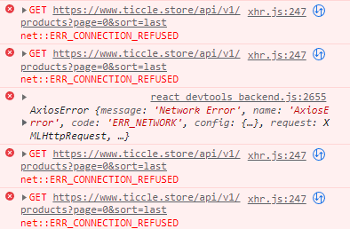

# 💵 **티끌모아 태산! tickle +** 💵

## ✨ 배포사이트

- 🔗 [tickle plus](https://tickleplus.netlify.app)

- 테스트 계정
  - ID:
  - password:

 

## 🌱 프로젝트 소개

[개요]

[링크]

- 레포
- 노션
- 피그마

## 👩‍💻 팀원 소개(프론트엔드)

<table>
  <tbody>
    <!-- <tr>
  <td align="center"></td>
  <td align="center"></td>
  <td align="center"></td>
  <td align="center"></td>
  </tr> -->
  <tr>
  <td align="center"><a href="https://github.com/hae9">강해경</a></td>
  <td align="center"><a href="https://github.com/Hyeeeein">김혜인</a></td>
  <td align="center"><a href="https://github.com/hwanky">최지환</a></td>
  <td align="center"><a href="https://github.com/dreamchach">김지영</a></td>
 </tr>
  </tbody>
</table>

## ⚙ 기술 스택

  

## 📆 과제 기간

- 
2023. 2. 13 ~ 2022. 2. 24.
    

## 📌 작업영역 및 구현 기능 설명

 

<b>강해경</b>

- 홈 화면
  - 슬라이드 : ~~
  - 태그별 상품 보기
- 추천상품
- 검색

<b>김혜인</b>

- 로그인
  - 유효성 검사
  - 로그인 상태, 유저 정보 상태 관리
  - ProtectedRoute 로 경로 보호
  - accessToken, refreshToken 관리
- 회원가입
  - 유효성 검사
- (미완)설문조사
  - 회원가입 이후 즉시 선택 가능하도록 설정(API 오류로 구현X)

<b>최지환</b>

- 상세 페이지
    - 상품 클릭 시 해당 상품의 상세 페이지로 이동
    - 관심 상품 등록 / 해제 (로그인 시 가능)
    - 상품 신청(로그인 시 가능) / 이미 신청한 상품 예외처리
    
- 관심 상품 페이지
    - 신청한 관심 상품 리스트업
    - 삭제 / 전체삭제 기능

<b>김지영</b>

- 마이페이지
  - 내 정보 보기
    - 내 정보 확인
    - 내 정보 수정 (수정 시 비밀번호 필요/ 비밀번호와 전화번호를 잘못입력할 시 경고창 발생)
  - 신청한 상품 보기
    - 신청한 상품 획인(필터링 가능(은행별, 예적금별))
    - 신청한 상품 취소 가능

 

## 💦 어려웠던 점

- 백엔드 측 서버가 준비되는데 생각보다 시간이 많이 소요되어 프론트엔드 기능 구현을 하는 시간이 촉박했습니다.
- 백엔드에 대한 이해가 부족하다보니 소통을 하는 데에 어려움이 있었습니다.

  

## 💡 질문사항 및 미해결 에러

#### ERR_CONNECTION_REFUSED 에러

갑자기 다른 프론트엔드 팀원들과는 달리 혼자만 콘솔에 해당 에러가 뜨면서 모든 api 호출을 되지 않습니다. 프록시 설정도 해주고, 브라우저 캐시도 삭제해주고, 재부팅도 해주고, 방화벽도 꺼보는 등 방법을 써봤지만 되지 않았습니다. 간간히 다시 api 호출이 정상적으로 되어서 작업을 하다보면 금방 해당 오류를 띄웁니다.
